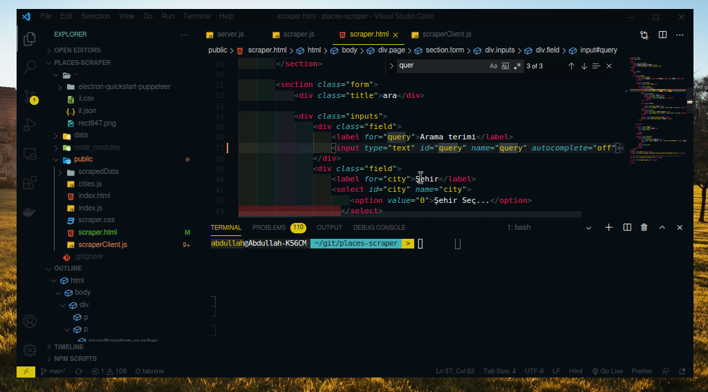

# Get Places from Maps with Headless Browser (via Puppeteer)
(Still under development)

## Tools used
- Node.js
- Socket.io
- Puppeteer
- express
- jsonexport, export-from-json and serve-index

## Usage
- Clone repo
- `npm install`
- `npm start`
- Served in `localhost:3000/googleplaces`

## Demo

